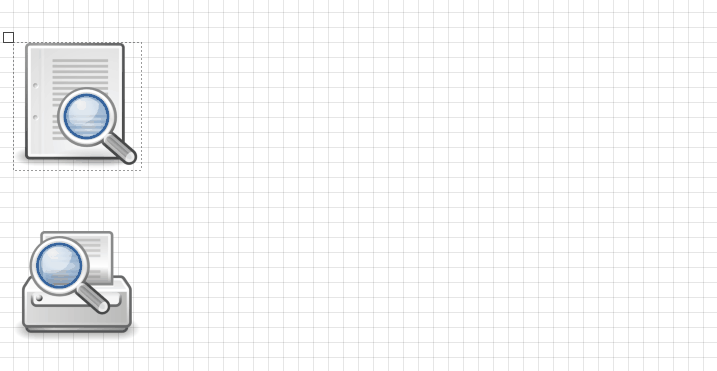

# Bach
Compose components using a generic designer.


## Overview
Sometimes you need a relatively simple, low-level, generic designer library that's open to extension. Bach is designed to enable you to build interconnected diagrams of *bricks* (some sort of image representing an attached object) with a simple mechanism for defining rules about which sorts of brick can connect to which other sorts etc. This code was extracted from the [Denobo](https://github.com/lambdacasserole/Denobo) network designer utility and made as generic as possible.



## Prerequisites
Bach is written in Java, and makes use of Swing. Batteries are definitely not included whatsoever, it's entirely up to you to define your own bricks (by subclassing the abstract `Brick` class), handle image loading, and define your object model. Context menus are supported, but once again you'll have to define your own. Images are not included, those used in the preview are from the [Tango Icon Library](http://tango.freedesktop.org/Tango_Icon_Library).

## Use Case
The library is designed to be very general-purpose. If you need a starting point for simply modelling the relationships between objects, with some constraints, Bach might be for you.

## Quickstart
See below for some code that'll get you started quite quickly. Remember you have to define `MyCustomBrick1` and `MyCustomBrick2` yourself by subclassing `Brick`.

```java
import javax.swing.*;
import com.sauljohnson.bach.*;

public class QuickBachTest {

    /**
     * The application entry point.
     *
     * @param args the command-line arguments to the application
     */
    public static void main(String[] args) {
        JFrame mainFrame = new JFrame();
        Designer designer = new Designer(null); // New designer, no context menu.

        // Add designer to form.
        mainFrame.add(designer);
        mainFrame.setDefaultCloseOperation(JFrame.EXIT_ON_CLOSE);
        mainFrame.show();

        // Initialise a new brick (you have to define this yourself by subclassing Brick).
        MyCustomBrick1 b1 = new MyCustomBrick1(null, 0, 0);

        // Initialise a new brick of a different type.
        MyCustomBrick2 b2 = new MyCustomBrick2(null, 0, 0);

        // Add bricks to designer.
        designer.addBrick(b1);
        designer.addBrick(b2);
    }
}
```

## Acknowledgements
Credit to my original co-creators of [Denobo](https://github.com/lambdacasserole/Denobo), [Alex Mullen](https://github.com/alexmullen) and [Lee Oliver](https://github.com/Lee34723) for their part in building the original software.

The [Tango Icon Library](http://tango.freedesktop.org/Tango_Icon_Library) (used in the preview GIF) is an excellent free icon pack that I recommend checking out.
